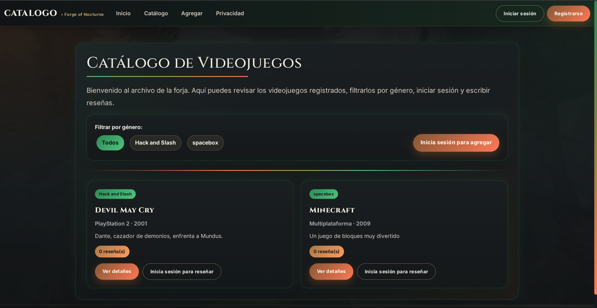
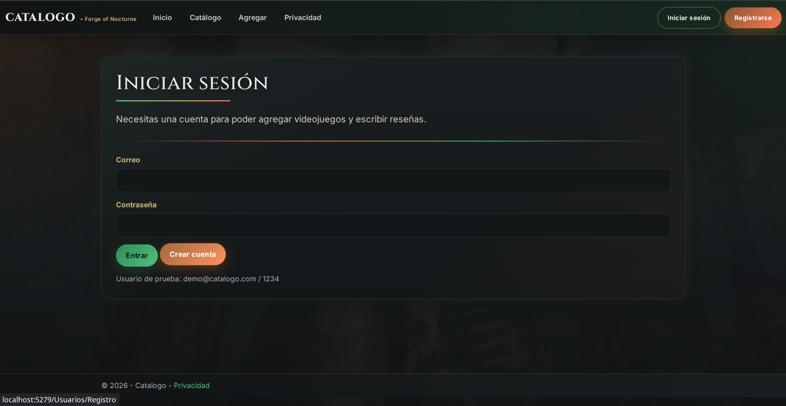
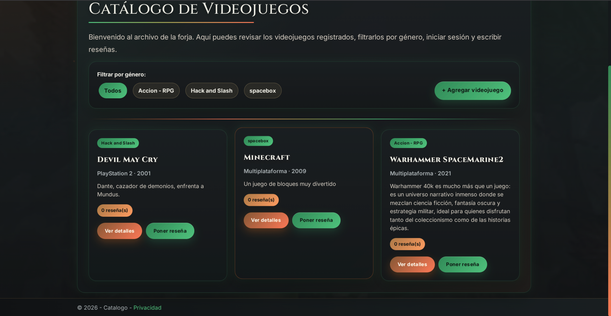
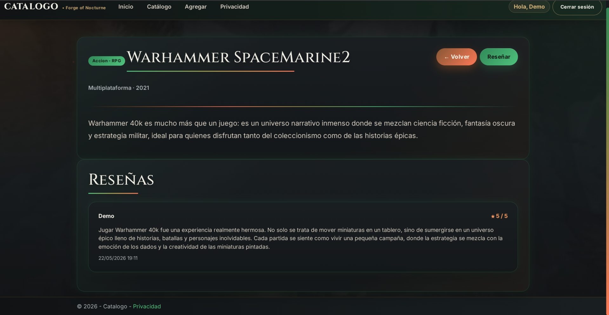

# CatalogoApp - Catálogo de Videojuegos con Login y Reseñas

Este proyecto es una aplicación web desarrollada con **C#, ASP.NET Core MVC y .NET 10**. La aplicación permite visualizar un catálogo de videojuegos, filtrar por género, registrar usuarios, iniciar sesión, agregar nuevos videojuegos y escribir reseñas.

La intención principal del proyecto fue construir una aplicación funcional con arquitectura por capas, almacenamiento en archivos **JSON** y una interfaz visual oscura inspirada en una estética tipo **Forja / Salamanders**, manteniendo compatibilidad con **JetBrains Rider en Arch Linux**.

---

## 👤 Datos del Estudiante

| Campo | Información |
| :--- | :--- |
| **Nombre** | Angel Abraham Lugo Saenz |
| **Matrícula** | SW2409052 |
| **Universidad** | Tecnológico de Software |
| **Profesor** | Jorge Javier Pedroza Romero |
| **Materia** | Arquitectura de Software |
| **Tarea** | Catálogo de videojuegos en ASP.NET Core MVC |

---

## 📝 Descripción General

La aplicación consiste en un catálogo web de videojuegos donde el usuario puede consultar juegos registrados, ver detalles, filtrar por género y revisar reseñas. Además, el sistema incluye autenticación básica mediante sesión, por lo que ciertas acciones solo están disponibles para usuarios logueados.

Las restricciones principales del proyecto son:

* Un usuario no puede escribir reseñas si no ha iniciado sesión.
* Un usuario no puede agregar videojuegos si no ha iniciado sesión.
* Las reseñas se guardan dentro del archivo JSON de videojuegos.
* Los usuarios registrados se guardan en un archivo JSON independiente.
* El proyecto abre directamente en la ruta del catálogo.

---

## 🚀 Tecnologías Utilizadas

* **Lenguaje:** C#
* **Framework:** ASP.NET Core MVC
* **Versión de .NET:** .NET 10
* **Patrón:** MVC con separación por capas
* **Vistas:** Razor Views
* **Estilos:** HTML y CSS personalizado
* **Persistencia:** Archivos JSON
* **IDE recomendado:** JetBrains Rider
* **Sistema compatible:** Arch Linux
* **Herramientas:** .NET SDK, Git y GitHub

---

## 🧱 Retos del Proyecto

Durante el desarrollo se presentaron varios retos importantes:

* Configurar correctamente el proyecto para que JetBrains Rider lo reconociera como solución ejecutable.
* Mantener compatibilidad con **.NET 10** en Arch Linux.
* Agregar autenticación básica usando sesiones.
* Evitar que usuarios no logueados pudieran reseñar o agregar videojuegos.
* Guardar información en archivos JSON sin usar base de datos.
* Adaptar el diseño visual oscuro sin perder la funcionalidad del catálogo.
* Organizar el proyecto en capas para separar presentación, aplicación, dominio e infraestructura.
* Agregar nuevos controladores sin romper las funciones existentes.

---

## 📂 Estructura del Proyecto

```text
CatalogoApp/
├── CatalogoApp.sln
├── CatalogoApp.Domain/
│   ├── Models/
│   │   ├── Item.cs
│   │   ├── Resena.cs
│   │   └── Usuario.cs
│   └── Interfaces/
│       ├── IItemRepository.cs
│       └── IUsuarioRepository.cs
├── CatalogoApp.Application/
│   └── Services/
│       ├── ItemService.cs
│       └── UsuarioService.cs
├── CatalogoApp.Infrastructure/
│   └── Repositories/
│       ├── JsonItemRepository.cs
│       └── JsonUsuarioRepository.cs
├── CatalogoApp.Presentation/
│   ├── Controllers/
│   │   ├── CatalogoController.cs
│   │   ├── HomeController.cs
│   │   ├── ResenasController.cs
│   │   └── UsuariosController.cs
│   ├── Views/
│   │   ├── Catalogo/
│   │   ├── Home/
│   │   ├── Resenas/
│   │   ├── Shared/
│   │   └── Usuarios/
│   ├── data/
│   │   ├── items.json
│   │   └── usuarios.json
│   ├── wwwroot/
│   │   └── css/
│   │       └── site.css
│   ├── Program.cs
│   └── CatalogoApp.Presentation.csproj
├── assets/
│   └── evidencias/
│       ├── 01-catalogo-no-logueado.png
│       ├── 02-login-usuario.png
│       ├── 03-catalogo-logueado-agregar-resena.png
│       └── 04-detalle-resena-guardada.png
└── README.md
```

---

## ⚙️ Funcionalidades

**Catálogo de videojuegos:** muestra todos los videojuegos registrados en tarjetas visuales.

**Filtro por género:** permite visualizar juegos por categorías como `Hack and Slash`, `spacebox` o `Action - RPG`.

**Detalle de videojuego:** muestra la información completa del juego seleccionado.

**Registro de usuarios:** permite crear una cuenta dentro de la aplicación.

**Inicio de sesión:** permite que el usuario acceda a funciones restringidas.

**Cierre de sesión:** permite terminar la sesión actual.

**Agregar videojuego:** solo puede realizarse si el usuario inició sesión.

**Agregar reseña:** solo puede realizarse si el usuario inició sesión.

**Persistencia en JSON:** los videojuegos, usuarios y reseñas se conservan en archivos JSON.

---

## ❓ ¿De qué trata?

El proyecto trata de una aplicación web para administrar un catálogo de videojuegos. El usuario puede explorar juegos registrados, ver sus detalles y revisar reseñas. Si desea participar agregando nuevos videojuegos o escribiendo reseñas, debe iniciar sesión primero.

La aplicación simula una plataforma sencilla de catálogo y opinión, usando ASP.NET Core MVC como base y archivos JSON como almacenamiento local.

---

## 🧩 ¿Qué hicimos?

Se tomó como base un proyecto de catálogo MVC y se modificó para agregar nuevas funciones y un diseño visual personalizado. Entre los cambios realizados se encuentran:

* Se agregó un diseño oscuro inspirado en una estética de forja.
* Se creó un sistema básico de usuarios.
* Se agregó un controlador para usuarios llamado `UsuariosController`.
* Se agregó un controlador para reseñas llamado `ResenasController`.
* Se creó el archivo `usuarios.json` para almacenar cuentas registradas.
* Se adaptó `items.json` para guardar videojuegos y reseñas.
* Se bloquearon las acciones de agregar videojuego y reseñar si el usuario no está logueado.
* Se configuró la ruta inicial para abrir directamente el catálogo.
* Se preparó el proyecto para abrirse con `CatalogoApp.sln` en JetBrains Rider.

---

## ▶️ ¿Cómo funciona?

1. La aplicación inicia directamente en la página del catálogo.
2. El usuario puede ver los videojuegos registrados.
3. El usuario puede filtrar los juegos por género.
4. Si el usuario no ha iniciado sesión, puede ver juegos, pero no puede agregar videojuegos ni reseñas.
5. Para acceder a las funciones restringidas, el usuario debe iniciar sesión o registrarse.
6. Una vez logueado, el sistema muestra el nombre del usuario en la barra superior.
7. El usuario logueado puede agregar nuevos videojuegos.
8. El usuario logueado puede abrir un juego y escribir una reseña.
9. La reseña se guarda dentro de `items.json`.
10. Los usuarios registrados se guardan en `usuarios.json`.

---

# 🛠️ Comandos de Uso

## Desarrollo con .NET

```bash
# Restaurar dependencias
dotnet restore

# Compilar proyecto
dotnet build

# Ejecutar el proyecto web
dotnet run --project CatalogoApp.Presentation/CatalogoApp.Presentation.csproj
```

También se puede ejecutar desde la carpeta del proyecto de presentación:

```bash
cd CatalogoApp.Presentation
dotnet run
```

---

## Gestión con Git

```bash
# Inicializar repositorio
git init

# Agregar archivos
git add .

# Crear commit
git commit -m "CatalogoApp con login, reseñas y diseño personalizado"

# Conectar con GitHub
git remote add origin URL_DEL_REPOSITORIO

# Subir cambios
git push -u origin main
```

---

## 🖥️ Uso en JetBrains Rider

1. Abre JetBrains Rider.
2. Selecciona **Open**.
3. Abre el archivo `CatalogoApp.sln`.
4. Espera a que Rider restaure y sincronice los proyectos.
5. Selecciona como configuración de ejecución el proyecto `CatalogoApp.Presentation`.
6. Presiona **Run**.
7. Abre la ruta del navegador que indique Rider, por ejemplo:

```text
http://localhost:5279/Catalogo
```

---

## 📸 Evidencias de Ejecución

En esta sección se muestran capturas del proyecto funcionando correctamente en el navegador. Las imágenes muestran el catálogo, el login, las funciones disponibles al iniciar sesión y el guardado de reseñas.

### ✅ Catálogo sin usuario logueado

En esta pantalla se observa el catálogo principal cuando todavía no hay sesión iniciada. El sistema muestra los videojuegos disponibles, filtros por género y botones para iniciar sesión o registrarse. También se observa que para agregar o reseñar se solicita iniciar sesión.



### 🔐 Pantalla de inicio de sesión

En esta captura aparece el formulario de login. El usuario debe ingresar su correo y contraseña para poder acceder a funciones protegidas como agregar videojuegos o escribir reseñas.



### 🎮 Catálogo con usuario logueado

Aquí se muestra el catálogo después de iniciar sesión. El sistema permite agregar videojuegos y aparece el botón **Poner reseña** en cada tarjeta, ya que el usuario autenticado sí tiene permiso para escribir reseñas.



### ⭐ Detalle de videojuego con reseña guardada

En esta imagen se observa la vista de detalle de un videojuego. La reseña escrita por el usuario aparece guardada con nombre, calificación, comentario y fecha, demostrando que la información se conserva correctamente.



---

## 🐧 Requisitos en Arch Linux

Instala el SDK de .NET compatible con el proyecto:

```bash
sudo pacman -S dotnet-sdk
```

Verifica la instalación:

```bash
dotnet --list-sdks
dotnet --list-runtimes
```

El proyecto está configurado para:

```xml
<TargetFramework>net10.0</TargetFramework>
```

Por lo tanto, el sistema debe tener instalado el SDK y runtime de ASP.NET Core correspondientes a .NET 10.

---

## 🖌️ Personalización y Diseño

El proyecto utiliza un diseño oscuro personalizado dentro de `CatalogoApp.Presentation/wwwroot/css/site.css`. La interfaz usa colores verdes, naranjas y dorados para generar una estética tipo forja.

Elementos personalizados del diseño:

* Fondo oscuro con imagen y sombras.
* Barra de navegación superior.
* Botones con estilo redondeado.
* Tarjetas para videojuegos.
* Formularios oscuros para login, registro, agregar videojuego y reseñar.
* Separadores con degradado verde y naranja.
* Tipografía decorativa para títulos.

---

## 💻 Códigos Importantes

### Ruta inicial directa al catálogo

En `Program.cs` se configuró la ruta principal para que el proyecto abra directamente en el catálogo:

```csharp
app.MapControllerRoute(
    name: "default",
    pattern: "{controller=Catalogo}/{action=Index}/{id?}");
```

### Activación de sesiones

La sesión permite saber si el usuario inició sesión:

```csharp
builder.Services.AddSession();
app.UseSession();
```

### Validación para reseñar solo si hay login

En `ResenasController` se valida que exista un usuario en sesión antes de permitir la reseña:

```csharp
var usuario = HttpContext.Session.GetString("UsuarioNombre");

if (string.IsNullOrEmpty(usuario))
{
    return RedirectToAction("Login", "Usuarios");
}
```

### Validación para agregar videojuegos solo si hay login

En `CatalogoController` se restringe la acción de agregar videojuegos:

```csharp
var usuario = HttpContext.Session.GetString("UsuarioNombre");

if (string.IsNullOrEmpty(usuario))
{
    return RedirectToAction("Login", "Usuarios");
}
```

---

## ✅ Validación de Entrada

El proyecto valida datos importantes para evitar registros incompletos:

* El usuario debe escribir correo y contraseña para iniciar sesión.
* El usuario debe estar logueado para agregar videojuegos.
* El usuario debe estar logueado para escribir reseñas.
* Las reseñas incluyen comentario y calificación.
* Los videojuegos agregados se guardan con nombre, género, plataforma, año y descripción.

Estas validaciones ayudan a mantener el funcionamiento correcto de la aplicación y evitan acciones no permitidas.

---

## 📈 Mejoras Futuras

[ ] Encriptar contraseñas en lugar de guardarlas como texto.

[ ] Agregar validaciones más avanzadas en formularios.

[ ] Permitir editar y eliminar videojuegos.

[ ] Permitir editar y eliminar reseñas.

[ ] Agregar búsqueda por nombre de videojuego.

[ ] Agregar imágenes para cada videojuego.

[ ] Migrar la persistencia de JSON a una base de datos.

[ ] Agregar roles de administrador y usuario normal.

[ ] Mejorar la adaptación responsive para celular.

---

## 🏁 Conclusión

Este proyecto permitió aplicar conceptos de arquitectura de software en una aplicación web real usando ASP.NET Core MVC. Se separaron responsabilidades en capas, se implementó persistencia con archivos JSON y se agregaron restricciones de sesión para controlar las acciones del usuario.

Además, el proyecto combina funcionalidad con diseño visual personalizado, logrando un catálogo de videojuegos más completo, atractivo y funcional. La aplicación permite consultar juegos, registrar usuarios, iniciar sesión, agregar videojuegos y escribir reseñas respetando las reglas establecidas.

---

# Clausula de IA

```text
Yo Angel Abraham Lugo Saenz declaro que utilice IA,
para realizar mi README.
```

**Nota:** Este README fue elaborado con apoyo de una IA a partir de la información proporcionada por Angel Abraham Lugo Saenz.
